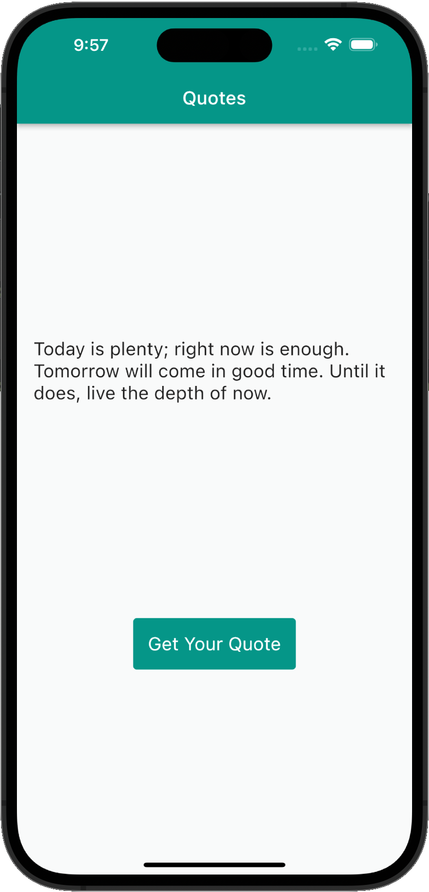

# Flutter Clean Architecture Proposal

In general, code without guidelines can't be maintainable and scalable.

## Content

You can find in this repository, how clean code architecture solves our problems, and find a way to communicate between layers,

You might have seen this graph already:
 
 

 
 

## Inside The App

 
 

